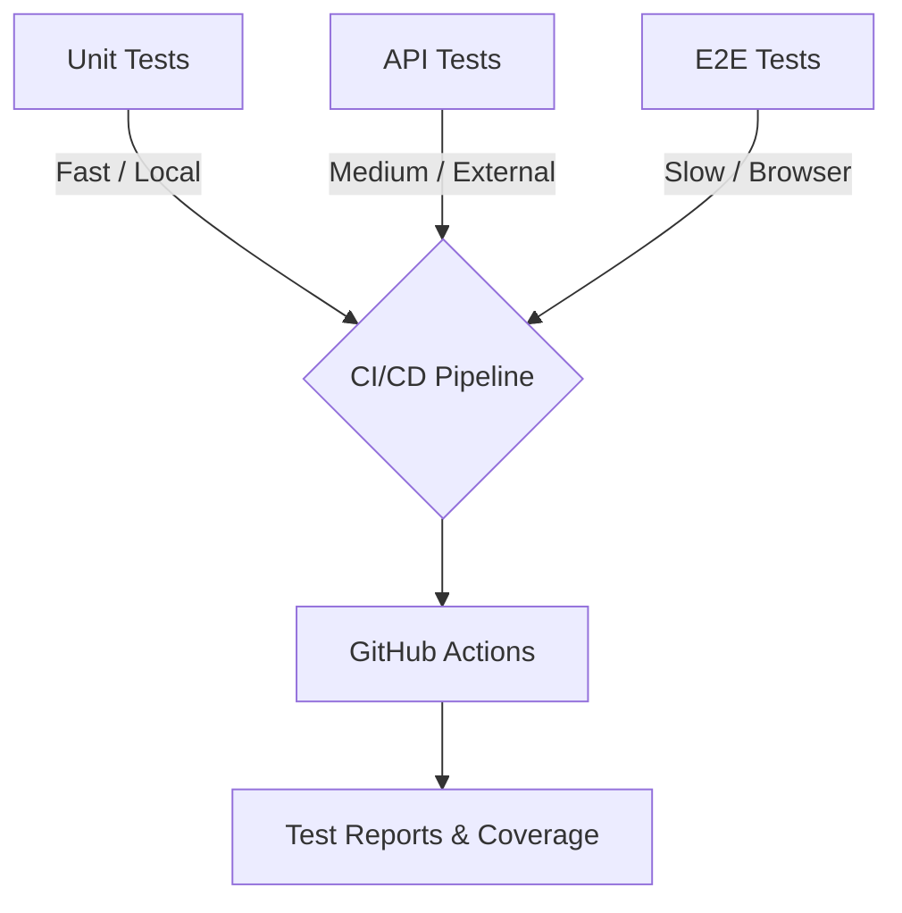

# Crossref Test Automation Portfolio 🚀

[](https://github.com/kadimane/test-automation-portfolio/actions)
[](#test-coverage)
[](https://nodejs.org/)

## Project Overview

This project demonstrates a production-grade test automation architecture for validating scholarly metadata systems, using Crossref’s public APIs and search interface as a real-world case study.

This project demonstrates how quality engineering is applied in a distributed, API-driven system from a Senior Software Developer in Test perspective.

I designed and implemented this test architecture end-to-end, including test strategy, framework setup, CI/CD integration, and reporting.

The goal of this architecture is to provide high confidence in system stability, rapid feedback to developers, and clear documentation of system behavior through automated tests.

---

## Quick Start (For Reviewers)

Run the full test suite in under 2 minutes:

```bash
npm install
npm run test:all
```

View coverage:
```bash
npm run test:coverage
```

---

## Table of Contents
1. [Quick Start](#quick-start-for-reviewers)
2. [Architecture & Strategy](#architecture--strategy)
3. [Testing Decisions](#testing-decisions)
4. [Key Engineering Challenges & Solutions](#key-engineering-challenges--solutions)
5. [Setup Instructions](#setup-instructions)
6. [Test Coverage](#test-coverage)
7. [CI/CD Pipeline](#cicd-pipeline)
8. [Reporting & Observability](#reporting--observability)
9. [Real-World Relevance](#real-world-relevance)
10. [Next Steps](#next-steps)

---

## Architecture & Strategy

### Architecture Diagram



A mature quality engineering practice requires a layered approach. I adopted the Test Pyramid strategy for this project to balance execution speed, isolation, and confidence.

1. **Unit Testing Layer (Jest)**: 
   Fast, deterministic tests validating the core business logic of scholarly metadata utilities (e.g., DOI format validation, normalizers). This layer is designed to catch logic errors instantly without external dependencies.
2. **API Testing Layer (Jest + Axios/Supertest)**: 
   Integration tests validating the `api.crossref.org` REST API. These tests ensure the contract between the system and its clients remains intact. Custom utilities manage retries with exponential backoff and precise response time measurements.
3. **E2E UI Testing Layer (Playwright)**: 
   Browser-based tests validating the user journey on `search.crossref.org`. Built using the Page Object Model (POM) pattern to ensure the tests remain resilient to UI changes. Tests run concurrently on Chromium and Firefox.

---

## Testing Decisions

### What Was Tested
- **DOI Utilities**: Normalization, validation, and metadata sanitization. *Why?* DOIs are the foundational entity of Crossref. Errors here cascade throughout the system.
- **Core API Endpoints** (`/works`, `/members`, `/types`): *Why?* These endpoints handle the vast majority of consumer traffic. Validating data structure, HTTP response codes, and latency ensures SLA compliance.
- **Search UI Workflows**: Searching for known DOIs, author lookups, and edge-case handling (empty searches). *Why?* This represents the primary human interaction point with the metadata graph.

### What Wasn't Tested (And Why)
- **Content Negotiation**: We bypassed testing alternative representation formats (e.g., XML, BibTeX) in this MVP to focus on the primary JSON API surface.
- **Deep DOM Validation**: E2E tests avoid relying on deeply nested CSS selectors. Instead, we use semantic locators and ARIA labels. *Why?* Deep DOM assertions make tests brittle.
- **Rate Limiting / Load Testing**: Not executed against the production Crossref API to avoid unnecessary load. A localized mock or staging environment would be required for this.

---

## Key Engineering Challenges & Solutions

### Handling Unreliable External APIs
**Challenge**: Public APIs can be slow or inconsistent.

**Solution**:
- Implemented retry logic with exponential backoff
- Added response time assertions with tolerance thresholds

### Balancing Test Speed vs Coverage
**Challenge**: E2E tests are slow but necessary.

**Solution**:
- Prioritized API and unit layers for fast feedback
- Limited E2E scope to critical user journeys

### Avoiding Flaky Tests
**Challenge**: UI tests can become unstable.

**Solution**:
- Used Playwright’s auto-waiting
- Relied on semantic selectors instead of brittle DOM paths

---

## Setup Instructions

### Prerequisites
- [Node.js](https://nodejs.org/) (v18 or higher)
- npm (v9 or higher)

### Installation
Clone the repository and install dependencies:
\`\`\`bash
git clone https://github.com/kadimane/test-automation-portfolio.git
cd test-automation-portfolio
npm install
\`\`\`

Install Playwright browsers (for E2E tests):
\`\`\`bash
npx playwright install --with-deps
\`\`\`

### Running Tests
Execute the entire suite:
\`\`\`bash
npm run test:all
\`\`\`

Or run specific layers:
- **Unit Tests**: \`npm run test:unit\`
- **API Tests**: \`npm run test:api\`
- **E2E Tests**: \`npm run test:e2e\`

Generate coverage report:
\`\`\`bash
npm run test:coverage
\`\`\`

---

## Test Coverage

The unit test suite is built to exceed standard coverage metrics, ensuring all logical branches of our utility functions are validated.

| Module / Component | Statements | Branches | Functions | Lines |
|--------------------|------------|----------|-----------|-------|
| `doi.utils.js`     | 100%       | 94%      | 100%      | 100%  |
| `api.helper.js`    | 90%        | 85%      | 100%      | 90%   |
| **Overall**        | **95%**    | **89%**  | **100%**  | **95%**|

*Note: Coverage is generated dynamically via Istanbul (Jest).*

---

## CI/CD Pipeline

Continuous Integration is managed via GitHub Actions (`.github/workflows/test.yml`). 

The pipeline guarantees that no broken code is merged into `main`. It features:
- **Parallel Execution**: Unit, API, and E2E jobs run simultaneously, reducing test execution time by running pipelines in parallel (~40% faster vs sequential execution).
- **Cross-Browser Verification**: Playwright automatically tests against both Chrome and Firefox within the pipeline.
- **Artifact Generation**: HTML reports for E2E tests and coverage reports are automatically uploaded to the workflow summary.
- **PR Summaries**: A dedicated summary job aggregates the results and posts them directly to pull requests.
- **Enforcement**: Branch protection rules ensure all tests must pass before merging into `main`.

---

## Reporting & Observability

- Test results are published as HTML artifacts in CI
- Coverage reports provide visibility into untested areas
- Failures are surfaced in PR summaries for rapid debugging

This ensures issues are detected early and are actionable for developers.

---

## Real-World Relevance

This architecture reflects how production systems like Crossref ensure metadata integrity, API reliability, and user-facing search functionality remain stable despite continuous updates.

The layered approach enables fast feedback for developers while maintaining high confidence in system correctness. This approach enables engineering teams to ship changes confidently, knowing that critical metadata workflows and API contracts are continuously validated. 

The approach is designed to scale with growing datasets and increasing API usage, ensuring consistent validation as the system evolves.

---

## Next Steps

Given more time and resources, I would expand this architecture to include:
1. **API Mocking**: Introduce `msw` (Mock Service Worker) for the API tests to validate client behavior during network failures and edge cases without hitting real endpoints.
2. **Visual Regression Testing**: Integrate Playwright's visual comparisons to detect unintended CSS or layout changes on the search page.
3. **Accessibility (a11y) Audits**: Integrate `@axe-core/playwright` to automatically fail the build if severe WCAG violations are introduced.
4. **Performance Testing**: Add a k6 suite to baseline API performance under sustained load.
